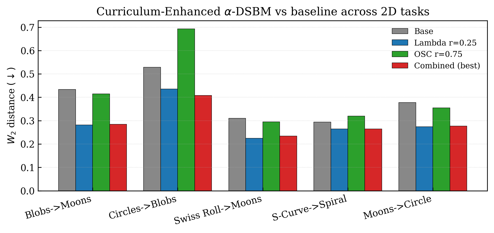
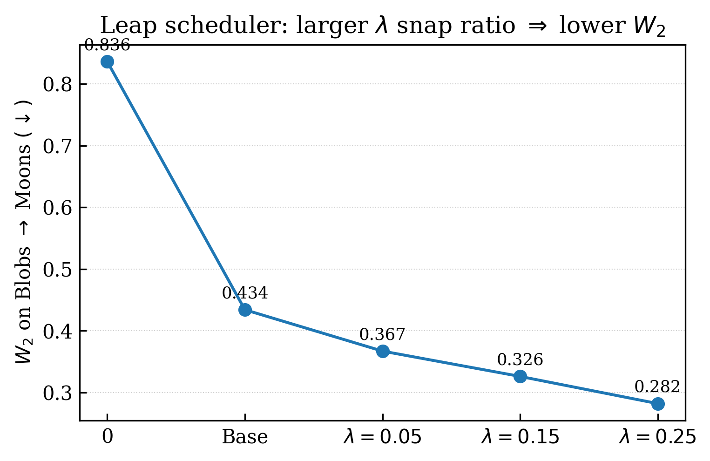
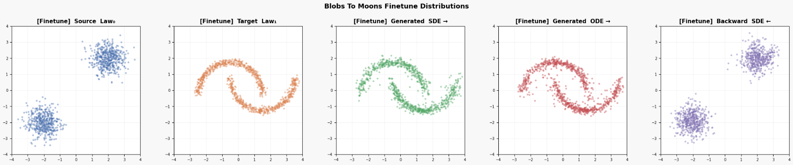
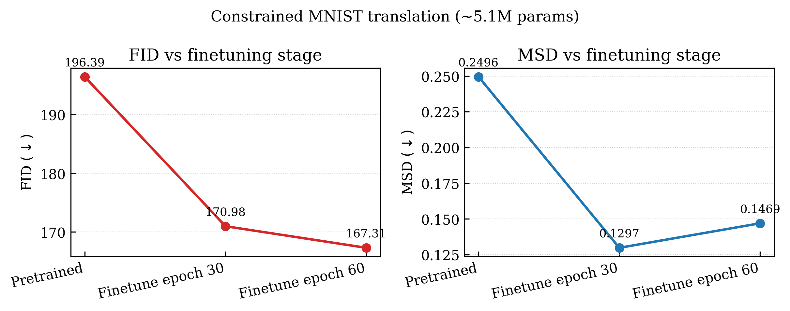
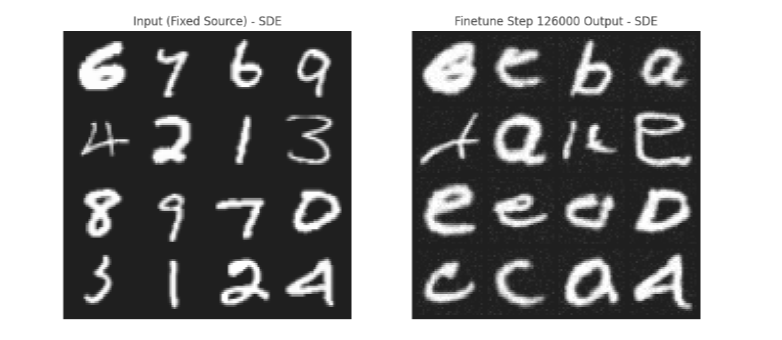

# Curriculum-Enhanced α-DSBM

**Adapting Schrödinger Bridge Flows for Constrained Compute** — a curriculum
scheduling extension to α-DSBM that resolves the training collapse observed
when the network is scaled down to ~5M parameters and trained on a single GPU.

Authors: Faissal Izermine, Dhia Garbaya · Master MVA (ENS Paris-Saclay), Deep Learning course.

> Report: [`docs/REPORT.pdf`](docs/REPORT.pdf) · Poster: [`docs/POSTER.pdf`](docs/POSTER.pdf)
>
> Builds on **α-DSBM**: *Schrödinger Bridge Flow for Unpaired Data Translation* (De Bortoli et al., arXiv:2409.09347).

---

## 1. Problem

Given unpaired samples from a source distribution π₀ and target π₁, learn a
transport map. The **Schrödinger Bridge** formulation seeks a continuous path
measure ℙ* that minimises KL(ℙ ∥ ℚ) under the marginal constraints
ℙ₀ = π₀, ℙ₁ = π₁ with ℚ a scaled Brownian motion (paper §2). **α-DSBM**
parameterises a single drift network v_θ(t, x, s) with a direction switch
s ∈ {0, 1}, takes a single gradient step per iteration, and uses an EMA
copy of the network to generate the bridge endpoints during finetuning.

**The problem we tackled.** α-DSBM as published needs a 9M-parameter U-Net
and ~16 v3 TPUs for the MNIST↔EMNIST setup. Under a ~5M-parameter single-GPU
budget, the standard finetuning loop **collapses entirely**: the drift field
goes to zero and the model outputs back the source samples. Increasing the
budget to 72h on a P100 does not fix it — the instability is structural.

## 2. Method: Curriculum-Enhanced α-DSBM

We keep the pretraining phase intact and replace the finetuning loop with two
coupled schedulers (paper §5.1). Full pseudocode is Algorithm 1 of the report.

### 2.1 Leap Scheduler λ(n)

Cosine ramp from `λ₀ = 0` to `1` over the first `r · N` finetuning steps,
then constant 1. Used to **blend** the true endpoints with EMA-generated
ones before computing the bridge interpolation:

```
X_blended = lerp(X_true, X_tilde, λ(n))
```

Early training mostly targets the network's own outputs (easier curriculum);
later it "leaps" toward the true distribution. Implementation:
[`src/sb/schedulers.py::LeapScheduler`](src/sb/schedulers.py).

### 2.2 Oscillating Scheduler (α_osc, β_osc)

Damped sinusoid around 0.5:

```
α_osc(n) = clamp(0.5 + 0.5 · exp(−δ τ) · sin(2π f τ + φ), 0, 1),    β_osc = 1 − α_osc
```

with τ = n / n_snap and φ ∼ Unif([0, 2π)) drawn at init. Used to weight the
forward and backward losses:

```
L = α_osc · ℓ_fwd + β_osc · ℓ_bwd
```

Original α-DSBM trains two separate networks for the two drift directions;
here a single network shares parameters, so this cosine shift prevents
catastrophic forgetting of either direction while keeping α + β = 1 to
avoid biased gradient amplification. Implementation:
[`src/sb/schedulers.py::OscillatingScheduler`](src/sb/schedulers.py).

### 2.3 Architecture (~5.1M params)

Drift network is a U-Net with:

- **ResBlocks** with double **AdaIN** conditioning (FiLM-style γ, β computed from time + direction embedding) per encoder/decoder block.
- **Self-attention at the 8×8 bottleneck** for global context.
- Sinusoidal time embedding + learned linear direction embedding (s ∈ {0, 1}).
- `base_channels = 128` ⇒ encoder: 1 → 128 → 256, bottleneck: 256, decoder mirrors.

Total: ~5.10 M trainable parameters. See
[`src/sb/models.py::EnhancedUNet`](src/sb/models.py) for the parameter breakdown.

## 3. Repository structure

```
.
├── docs/
│   ├── REPORT.pdf                  ← full method + experiments
│   └── POSTER.pdf
├── src/sb/
│   ├── models.py                   ← EnhancedUNet, SimpleUNet, BidirectionalMLP
│   ├── schedulers.py               ← LeapScheduler + OscillatingScheduler
│   ├── data.py                     ← MNIST / EMNIST loaders (32×32, [-1, 1])
│   ├── bridge.py                   ← SchrodingerBridgeMatching (pretrain + finetune)
│   ├── eval.py                     ← FID (clean-fid) + MSD pipeline
│   └── visualization.py            ← training-progress sample grid
├── scripts/
│   ├── train_mnist.py              ← end-to-end training entry point
│   ├── eval_checkpoints.py         ← evaluate FID/MSD across checkpoints
│   └── make_report_plots.py        ← reproduce figures/*.png from report values
├── figures/
│   ├── w2_2d_tasks.png             ← Table 1 bar chart
│   ├── w2_lambda_sweep.png         ← λ snap-ratio sweep on Blobs→Moons
│   ├── fid_mnist_stages.png        ← Table 2 FID/MSD curves
│   ├── fig1_blobs_to_moons.png     ← Figure 1 from REPORT.pdf
│   └── fig2_mnist_samples.png      ← Figure 2 from REPORT.pdf
└── legacy/CODE_CLEAN.ipynb         ← original monolithic submission notebook
```

## 4. Setup

```bash
pip install -r requirements.txt
pip install -e .            # exposes the `sb` package
```

CUDA is auto-detected. A single P100 / V100 is enough to reproduce the
constrained MNIST experiment in <72 h; CPU is sufficient only for the 2D
toy datasets.

## 5. Training

```bash
# Constrained MNIST ↔ EMNIST, ~5.1M params, paper hyperparameters.
python scripts/train_mnist.py \
    --pretrain-epochs 213 --finetune-epochs 60 \
    --base-channels 128 --batch-size 128 \
    --ratio-leap 0.05 --ratio-osc 0.75 \
    --output-dir checkpoints \
    --wandb-project curriculum-dsbm
```

All defaults match the values used to produce Table 2. Useful overrides:

- `--base-channels 64` — ablation with the original ~1.4M-param U-Net.
- `--ratio-leap 0.0` — disable the Leap Scheduler (collapses on MNIST).
- `--ratio-osc 0.0` — disable the Oscillating Scheduler.
- `--resume-pretrain path/to/pretrained.pt`, `--resume-finetune ...`

## 6. Evaluation

```bash
python scripts/eval_checkpoints.py \
    --checkpoints \
        checkpoints/pretrained_final.pt=Pretrained \
        checkpoints/finetune/step_56000.pt=Finetune-30 \
        checkpoints/finetune/step_112091.pt=Finetune-60 \
    --n-samples 4000 --num-steps 30
```

Reports FID (via `clean-fid` against the full MNIST training set) and MSD on
the EMNIST test split.

## 7. Results

### 2D toy datasets (Table 1 of the report)



Every Lambda and Combined configuration beats the Base finetuning on W₂
across all five tasks; the best Combined run cuts W₂ by **up to 35%** on
Blobs→Moons.



The improvement is monotonic in the Leap scheduler's snap ratio: completing
the cosine ramp over a larger fraction of training yields lower W₂.



Source / target / generated (SDE forward, ODE forward, SDE backward). The
backward transport is as accurate as the forward one — a key property
absent from one-way generative models.

### Constrained MNIST → EMNIST (Table 2)



Standard α-DSBM **collapses entirely** at this scale (drift field → 0,
model reverts to outputting X₀). With our curriculum schedulers, FID and
MSD both decrease monotonically across pretraining and finetuning.



Input MNIST digits (left) and the corresponding EMNIST letters generated
by our SDE rollout after pretraining + curriculum finetuning. Despite the
constrained budget, the model retains visible structure — converging
behaviour, not collapse.

## 8. Reproducing the plots

```bash
python scripts/make_report_plots.py
```

This re-renders `figures/w2_*.png` and `figures/fid_mnist_stages.png`
from the values transcribed from REPORT.pdf Tables 1 and 2.

## 9. Citation

```bibtex
@misc{izermine2025curriculum,
  title   = {Adapting Schr\"odinger Bridge Flows for Constrained Compute:
             Curriculum-Enhanced $\alpha$-DSBM},
  author  = {Izermine, Faissal and Garbaya, Dhia},
  year    = {2025},
  note    = {Master MVA, Deep Learning project. See \texttt{docs/REPORT.pdf}.}
}
```

Underlying α-DSBM:

```bibtex
@article{debortoli2024schrodinger,
  title   = {Schr\"odinger Bridge Flow for Unpaired Data Translation},
  author  = {De Bortoli, Valentin and Korshunova, Iryna and Mnih, Andriy and Doucet, Arnaud},
  journal = {arXiv preprint arXiv:2409.09347},
  year    = {2024}
}
```
